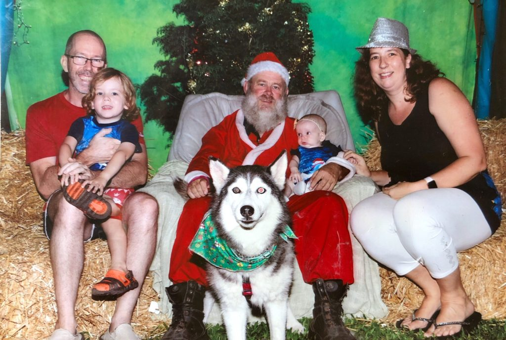
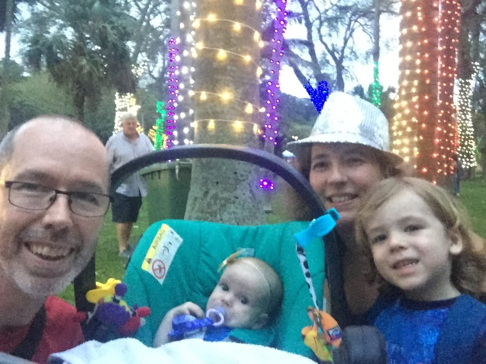

Tonight we took Kyle and Ayla on a family outing to the Botanic Gardens Trail of Lights.

As the day progressed I was getting as excited as my darling little three year old firecracker.

<!--more-->

Memories flooded back to me of going to the Wemmer Pan lights as a child. Wandering through the displays, looking at all the Christmas scenes. Watching the musical fountains as we ate hot dogs or vetkoek. Wonderful childhood memories. Memories too of my time in America. Driving around to see the decorated houses. Going to the state park near Annapolis to drive through their light displays.

The anticipation was growing and I was really looking forward to it. Dressed the kids up on matching outfits. I knew that we would go and get photos with Santa tonight.

And then we arrived. To chaos! Cars everywhere, long queues already visible, before we had even found parking. My heart was already starting to sink. I don’t do well in queues, especially ones that feel disorganised. And Kyle is even worse! Bracing ourselves we joined the queue. It was probably close to 30 minutes before we got inside.

Pretty coloured lights wrapped around the trees. It was a magical setting. We began wandering around. Elves, fairies, Olaf from Frozen, a Nut Cracker – lots of photo opportunities with dressed up characters.

{{}}

Santa’s Grotto, by the Husky Rescue, was set up and the queue wasn’t too bad to get our pic taken. So we decided to do that early and then wander around once it was nice and dark.

Ayla cried in Santa’s arms, so it ended up a family photo, mostly dominated by the gorgeous husky in the pic. And then I queued again. This time to pay and get the print. Well 45 minutes later and I was done. By this stage Ayla was losing the plot and Kyle was starting to get tired. We rushed around the rest of the display, missing a fair amount of the lights and displays. Completely missing the food trucks (which from the reviews sound like they ran out of food pretty early), missed most of the charities tables and just wanted to get out of there.

{{}}

When did my anticipation and excitement disappear? I wish I knew. I had so wanted it to be a magic evening as a family, but in the end it was just a lot of queueing, for a mediocre family photo with Santa and some lights.

I’m hoping that I can find some holiday spirit sometime soon and find the place inside me where I can cope with queues and crowds. It’s that time of year – they’re everywhere.

Kyle on the other hand loved it. Maybe it was the magical evening he was hoping for. I really hope so. Maybe my parents were equally frazzled after my childhood visits to Wemmer Pan. Maybe kids just remember the good stuff. Here’s hoping!